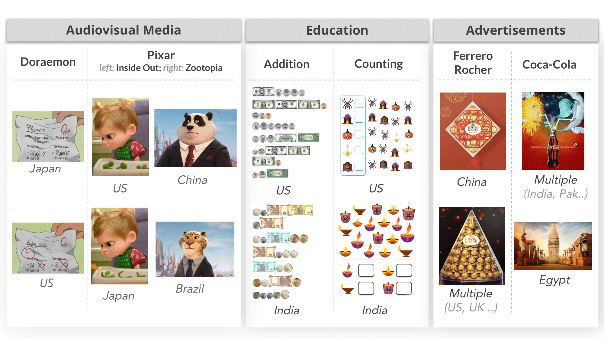

<div align="center">

<!-- TITLE -->
# *An image speaks a thousand words but can everyone listen?* On image transcreation for cultural relevance


[](https://arxiv.org/abs/2404.01247)
[](https://machine-transcreation.github.io/image-transcreation/)
</div>

This is the official implementation of the paper [*An image speaks a thousand words but can everyone listen?* On image transcreation for cultural relevance](https://arxiv.org/abs/2404.01247) by Simran Khanuja, Sathyanarayanan Ramamoorthy, Yueqi Song, and Graham Neubig.

## Abstract
Given the rise of multimedia content, human translators increasingly focus on culturally adapting not only words but also other modalities such as images to convey the same meaning. While several applications stand to benefit from this, machine translation systems remain confined to dealing with language in speech and text. In this work, we take a first step towards translating images to make them culturally relevant. First, we build three pipelines comprising state-of-the-art generative models to do the task. Next, we build a two-part evaluation dataset: i) *concept*: comprising 600 images that are cross-culturally coherent, focusing on a single concept per image, and ii) *application*: comprising 100 images curated from real-world applications. We conduct a multi-faceted human evaluation of translated images to assess for cultural relevance and meaning preservation. We find that as of today, image-editing models fail at this task, but can be improved by leveraging LLMs and retrievers in the loop. Best pipelines can only translate 5% of images for some countries in the easier concept dataset and no translation is successful for some countries in the application dataset, highlighting the challenging nature of the task.

## Code

### Setup
Create conda environment using `environment.yml`. The python version used is `Python 3.10.12`.
```
conda env create -f environment.yml
conda activate transcreation
```

### Pipeline 1: *e2e-instruct*
This pipeline uses the [InstructPix2Pix](https://www.timothybrooks.com/instruct-pix2pix) model to make an image culturally relevant to a target country. This is an end-to-end pipeline which only makes use of one image-editing model. To run the pipeline for a specific list of countries or all the countries, use the following commands:
```
bash ./scripts/part1/e2e-instruct.sh india,japan
bash ./scripts/part1/e2e-instruct.sh all
```

### Pipeline 2: *cap-edit*
In this pipeline, we first caption the images, edit the captions to make them culturally relevant, and use these captions to edit the original image. The steps to run this pipeline are given below:

#### Step 1: Get image captions using InstructBLIP and edit them using GPT-3.5
First, enter your OPENAI_API_KEY in `./configs/part1/caption-llm_edit/make_configs.sh`.

Next, we caption the images using InstructBLIP and edit them for cultural relevance, using GPT-3.5. For this, we first need to make config files for each country. To do this, run the following command:
```
bash ./configs/part1/caption-llm_edit/make_configs.sh
``` 

To run this step for a specific list of countries or all the countries, use the following commands:
```
bash ./scripts/part1/caption-llm_edit.sh portugal,turkey
bash ./scripts/part1/caption-llm_edit.sh all
```

#### Step 2: Edit images using LLM-edits and PlugnPlay
We've made modifications on top of `https://github.com/MichalGeyer/pnp-diffusers`. Kindly clone the fork of this repository from `https://github.com/simran-khanuja/pnp-diffusers` under `./src/pipelines/cap-edit`. Follow through their README and first create the `pnp-diffusers` environment. Image-editing using the plugnplay model involves two stages: a) obtain the noisy latents if the original image; and b) image-editing as per text guidance. To obtain latents for a specific list of countries or all the countries, use the following commands:
```
bash ./scripts/part1/step1_pnp_preprocess.sh brazil,nigeria
bash ./scripts/part1/step1_pnp_preprocess.sh all

```
To edit images according using the LLM edits as text guidance for a specific list of countries or all the countries, use the following commands:
```
bash ./scripts/part1/step2_pnp_img-edit.sh brazil,nigeria
bash ./scripts/part1/step1_pnp_preprocess.sh all
```

### Pipeline 3: *cap-retrieve*
#### Step 1: Get image captions and edit them using GPT-3.5
This step is the same as for `cap-edit`. There is no need to run anything here if step-1 of `cap-edit` is already run. Else, follow instructions from above to get captions and LLM edits.

#### Step 2: Retrieve images from LAION-{COUNTRY} using LLM-edits as text queries
Here, we will use the LLM-edits to retrieve relevant images from LAION. Since LAION has been redacted, this code is modified to use [Datacomp-1b](https://huggingface.co/datasets/mlfoundations/datacomp_1b) instead. To do this, first create a fresh environment by running:
```
conda create -n clip-ret-env python=3.10
conda activate clip-ret-env
```
We leverage the [clip-retrieval](https://github.com/rom1504/clip-retrieval) infrastructure to obtain indices in a scalable and efficient way. After activating the environment, run:
```
pip install clip-retrieval
``` 

Now, we will create country-specific subsets of Datacomp-1b. Navigate to `./src/pipelines/cap-retrieve/prepare_datacomp` and run `categorize_cctld.py` to create json files of image paths for each country. This script iterates over datacomp and creates country-specific json files based on the CCTLD of the image url. The list of CCTLDs can be found in `./src/pipelines/cap-retrieve/prepare_datacomp/cctld.tsv`. Next, run the following commands to create datasets from images, get embeddings for images and text, and create indices from the embeddings, respectively. We will query these indices to retrieve relevant images given the LLM-edited caption as a text query:
```
bash ./src/pipelines/cap-retrieve/prepare_datacomp/step1-img2dataset.sh
bash ./src/pipelines/cap-retrieve/prepare_datacomp/step2-embeddings.sh
bash ./src/pipelines/cap-retrieve/prepare_datacomp/step3-index.sh
```  

Now, to retrieve images from Datacomp given a text query (here, this is the LLM-edited captions obtained in Step-1), run the following:
```
bash ./scripts/part1/cap-retrieve.sh
```

### Model Outputs (Per Pipeline)

#### Pipeline-1
[Brazil-Concept](https://hub.zenoml.com/project/51904131-94ed-40fa-9a0b-51bc50c68f74/InstructPix2Pix%20(brazil-part1))

[Brazil-Application](https://hub.zenoml.com/project/d410950c-48db-4680-bb3d-fa98dd283137/InstructPix2Pix%20(Brazil-part2))

[India-Concept](https://hub.zenoml.com/project/e06d954d-0237-4082-bc8c-c69af17e3f52/InstructPix2Pix%20(india-part1))

[India-Application](https://hub.zenoml.com/project/683a3077-2558-4c60-a6fb-1dc60dc611d7/InstructPix2Pix%20(India-part2))

[Japan-Concept](https://hub.zenoml.com/project/24c0c40b-9755-4419-9950-ccbb049f07f8/InstructPix2Pix%20(japan-part1))

[Japan-Application](https://hub.zenoml.com/project/7cb964de-19cd-4268-8ac4-201c63b91d91/InstructPix2Pix%20(Japan-part2))

[Nigeria-Concept](https://hub.zenoml.com/project/683b0733-9ff4-4f1f-9852-44f11632d0d2/InstructPix2Pix%20(nigeria-part1))

[Nigeria-Application](https://hub.zenoml.com/project/f75add50-f44f-47a6-972e-5b0ae4cec5bf/InstructPix2Pix%20(Nigeria-part2))

[Portugal-Concept](https://hub.zenoml.com/project/0048843b-33ac-42a3-b54d-c0924c6db123/InstructPix2Pix%20(portugal-part1))

[Portugal-Application](https://hub.zenoml.com/project/d007e2f4-66f7-49ae-92eb-0289eeb69cc8/InstructPix2Pix%20(Portugal-part2))

[Turkey-Concept](https://hub.zenoml.com/project/822bb0a0-d08b-470d-8507-785fd1b330fb/InstructPix2Pix%20(turkey-part1))

[Turkey-Application](https://hub.zenoml.com/project/b50e91ac-823a-4594-bf83-126b0e2ba9fc/InstructPix2Pix%20(Turkey-part2))

[United-States-Concept](https://hub.zenoml.com/project/bc321f67-5c12-432b-9a99-61aabad36d82/InstructPix2Pix%20(US-part1))

[United-States-Application](https://hub.zenoml.com/project/a315829f-ff08-4eeb-92a2-bef043a92acf/InstructPix2Pix%20(US-part2))

#### Pipeline-2
[Brazil-Concept](https://hub.zenoml.com/project/10a0f8b3-d3d6-4b46-938c-c73f1f310cd4/Cap-LLMedit-Plugnplay%20(brazil-part1))

[Brazil-Application]

[India-Concept](https://hub.zenoml.com/project/7ff488ba-4d70-49c4-8f94-941687c4748a/Cap-LLMedit-Plugnplay%20(India-part1))

[India-Application]

[Japan-Concept](https://hub.zenoml.com/project/32ce490c-3253-4f1f-aebe-7f360e7d1b9c/Cap-LLMedit-Plugnplay%20(japan-part1))

[Japan-Application]

[Nigeria-Concept](https://hub.zenoml.com/project/c47a0438-f3af-446a-91af-e93662b91b6f/Cap-LLMedit-Plugnplay%20(nigeria-part1))

[Nigeria-Application]

[Portugal-Concept](https://hub.zenoml.com/project/51f5cad6-63d4-4159-b10f-432e9b3afa39/Cap-LLMedit-Plugnplay%20(portugal-part1))

[Portugal-Application]

[Turkey-Concept](https://hub.zenoml.com/project/1aef08d1-c1d1-4fa9-babf-15c15c8097dc/Cap-LLMedit-Plugnplay%20(turkey-part1))

[Turkey-Application]

[United-States-Concept](https://hub.zenoml.com/project/1d9b4650-8c17-4756-8336-6ac4cd3eca46/Cap-LLMedit-Plugnplay%20(united-states-part1))

[United-States-Application]

#### Pipeline-3
[Brazil-Concept](https://hub.zenoml.com/project/7232cbf1-e5a6-4c52-8a37-62e93c078869/part1%20brazil%20retrieval)

[Brazil-Application](https://hub.zenoml.com/project/e6b17e18-dbf7-4c76-a18f-d50f1b52e327/part2%20brazil%20retrieval)


[India-Concept](https://hub.zenoml.com/project/3210f7ed-b2cb-4593-96de-43072b5c3b0a/part1%20india%20retrieval)

[India-Application](https://hub.zenoml.com/project/13f225d3-70e1-40b7-ac37-17257dc9ed9e/part2%20india%20retrieval)


[Japan-Concept](https://hub.zenoml.com/project/51f58190-79aa-48ec-a289-e0f3180ff8c9/part1%20japan%20retrieval)

[Japan-Application](https://hub.zenoml.com/project/bb2df18a-747a-4638-8df3-e199be9c5410/part2%20japan%20retrieval)


[Nigeria-Concept](https://hub.zenoml.com/project/d137f45f-fff8-48c2-97c3-913d3c353bae/part1%20nigeria%20retrieval)

[Nigeria-Application](https://hub.zenoml.com/project/61a75edb-1c11-43f8-8550-abea8e6c941f/part2%20nigeria%20retrieval)


[Portugal-Concept](https://hub.zenoml.com/project/fef20f21-94d2-4e45-b54b-9bb4f4264ffd/part1%20portugal%20retrieval)

[Portugal-Application](https://hub.zenoml.com/project/82622627-e216-4120-b11d-1294cb7abaeb/part2%20portugal%20retrieval)


[Turkey-Concept](https://hub.zenoml.com/project/b1d4d2db-7b9e-431a-9922-f15178357935/part1%20turkey%20retrieval)

[Turkey-Application](https://hub.zenoml.com/project/20f1ed8e-4d67-455a-8c77-f878cdf05e64/part2%20turkey%20retrieval)


[United-States-Concept](https://hub.zenoml.com/project/1a3e82e3-e107-40db-ab33-d0c111cb2ef0/part1%20united-states%20retrieval)

[United-States-Application](https://hub.zenoml.com/project/7535d825-3134-4993-8a5a-373999cd9d54/part2%20united-states%20retrieval)

#### Bonus: GPT-4o + GPT-4 + DALL-E3
Here, we caption models using GPT-4o and ask GPT-4 to edit captions for cultural relevance. Finally, we prompt DALL-E3 to generate new images using the GPT4-edited caption.

[Brazil-Concept](https://hub.zenoml.com/project/45467ecf-a11b-419e-abf2-5e10fad8741b/dalle3-gpt4-brazil)

[Brazil-Application](https://hub.zenoml.com/project/69aa9e78-832f-4c28-b052-5f0db1a52787/dalle3-gpt4-brazil-pt2)

[India-Concept](https://hub.zenoml.com/project/89420e37-a435-423f-9777-9688b88a16b3/dalle3-gpt4-india)

[India-Application](https://hub.zenoml.com/project/a6aae39e-11b1-470c-95d1-9966dd2bbff3/dalle3-gpt4-india-pt2)

[Japan-Concept](https://hub.zenoml.com/project/41000aa9-a638-483e-8445-61012aac6bd5/dalle3-gpt4-japan)

[Japan-Application](https://hub.zenoml.com/project/f9ada64d-f66b-4b28-989b-b159a1109447/dalle3-gpt4-japan-pt2)

[Nigeria-Concept](https://hub.zenoml.com/project/069f0716-2483-4d9a-92e8-c0835410344c/dalle3-gpt4-nigeria)

[Nigeria-Application](https://hub.zenoml.com/project/01d18dc0-882f-4a0d-acb6-4aedf2cd53b5/dalle3-gpt4-nigeria-pt2)

[Portugal-Concept](https://hub.zenoml.com/project/adc9a920-a0e4-4bef-9c63-5a4efd8de0e6/dalle3-gpt4-portugal)

[Portugal-Application](https://hub.zenoml.com/project/c2139ec3-81f2-4328-ae0a-d923c0a3acab/dalle3-gpt4-portugal-pt2)

[Turkey-Concept](https://hub.zenoml.com/project/0ccb0517-f870-4361-b853-1be4f282f503/dalle3-gpt4-turkey)

[Turkey-Application](https://hub.zenoml.com/project/6d68c16d-641d-467f-b46b-a2d17ee88296/dalle3-gpt4-turkey-pt2)

[United-States-Concept](https://hub.zenoml.com/project/f14e806e-11ff-4fb1-8337-dcf22fa738da/dalle3-gpt4-united-states)

[United-States-Application](https://hub.zenoml.com/project/e86c0719-a723-4453-9578-f8e464541c79/dalle3-gpt4-united-states-pt2)


#### Bonus: GPT-4o + GPT-4 (multilingual captioning+editing) + DALL-E3
Here, we caption models using GPT-4o and ask GPT-4 to edit captions for cultural relevance in a language primarily spoken in that country. Finally, we prompt DALL-E3 to generate new images using the GPT4-edited caption.

[Brazil-Concept](https://hub.zenoml.com/project/edc564fb-73e7-4e40-8ce6-bca39e30cc14/dalle3-gpt4-brazil-multilingual)

[India-Concept](https://hub.zenoml.com/project/6ed5ce3d-b435-4c51-a7c0-58dd9742f9a2/dalle3-gpt4-india-multilingual)

[Japan-Concept](https://hub.zenoml.com/project/3109fadc-90f8-4935-9a5b-7871c4b51193/dalle3-gpt4-japan-multilingual)

[Nigeria-Concept](https://hub.zenoml.com/project/3109fadc-90f8-4935-9a5b-7871c4b51193/dalle3-gpt4-nigeria-multilingual)

[Portugal-Concept](https://hub.zenoml.com/project/3109fadc-90f8-4935-9a5b-7871c4b51193/dalle3-gpt4-portugal-multilingual)

[Turkey-Concept](https://hub.zenoml.com/project/3109fadc-90f8-4935-9a5b-7871c4b51193/dalle3-gpt4-turkey-multilingual)


### Model Outputs (Human Evaluation)
If y'all want to visualize model outputs for each part, please refer to the zeno links below. Note that the outputs were randomized for human evaluation, can you guess which pipeline each generated image is from? 😉

#### Brazil
[Concept-Split1](https://hub.zenoml.com/project/f7595e88-4092-430a-9d45-55c5ad3b52a4/brazil_part1_split_1)

[Concept-Split2](https://hub.zenoml.com/project/ce44019f-391d-417f-b7a2-58d678f2703e/brazil_part1_split_2)

[Concept-Split3](https://hub.zenoml.com/project/dbb5cbfb-ae48-420e-9a35-9e9d95b95ea4/brazil_part1_split_3)

[Concept-Split4](https://hub.zenoml.com/project/8e421113-0025-4e88-829d-c38d33676177/brazil_part1_split_4)

[Concept-Split5](https://hub.zenoml.com/project/548dc681-13f6-426a-9d54-9b003fa8155b/brazil_part1_split_5)

[Application](https://hub.zenoml.com/project/8f8f055b-9039-4ed3-8f06-358ce5226f23/brazil_part2_split_1)

#### India
[Concept-Split1](https://hub.zenoml.com/project/f04d325b-42b8-4aae-a365-fc9da34118c1/india_part1_split_1)

[Concept-Split2](https://hub.zenoml.com/project/f0bbf2d6-91ab-415f-a290-94acb00fd0e4/india_part1_split_2)

[Concept-Split3](https://hub.zenoml.com/project/dc33e300-4d4d-4541-91d2-ac485cfd02ee/india_part1_split_3)

[Concept-Split4](https://hub.zenoml.com/project/29de33e8-87ad-4546-8b5d-d959804a946f/india_part1_split_4)

[Concept-Split5](https://hub.zenoml.com/project/8634a759-bc13-41c3-9d4c-8fac3b05f9b7/india_part1_split_5)

[Application](https://hub.zenoml.com/project/c8de55f9-3309-4720-9578-753fe6222306/india_part2_split_1)

#### Japan
[Concept-Split1](https://hub.zenoml.com/project/bb47d9b1-d032-4867-baca-c86d3147dc9e/japan_part1_split_1)

[Concept-Split2](https://hub.zenoml.com/project/2ef27b9a-0f58-40a0-8b4e-216e403ce69c/japan_part1_split_2)

[Concept-Split3](https://hub.zenoml.com/project/3170eae8-8149-4549-b4f0-264ec8e20bca/japan_part1_split_3)

[Concept-Split4](https://hub.zenoml.com/project/b6de9d4f-f35b-42ec-830e-281e433d045c/japan_part1_split_4)

[Concept-Split5](https://hub.zenoml.com/project/b232ad0b-0636-4531-9317-5e04d497b499/japan_part1_split_5)

[Application](https://hub.zenoml.com/project/ca3f5718-b5b3-4a44-a571-d0111171d799/japan_part2_split_1)

#### Nigeria
[Concept-Split1](https://hub.zenoml.com/project/d7566a20-80ed-4ef1-9023-0bc35860da16/nigeria_part1_split_1)

[Concept-Split2](https://hub.zenoml.com/project/34d73e22-a897-4672-afcd-5d2c9841f7e6/nigeria_part1_split_2)

[Concept-Split3](https://hub.zenoml.com/project/64f3aaef-c819-4a6a-9a09-f9b87fa8a71b/nigeria_part1_split_3)

[Concept-Split4](https://hub.zenoml.com/project/b0022871-4cc0-4123-ab73-394c7a266bf8/nigeria_part1_split_4)

[Concept-Split5](https://hub.zenoml.com/project/b6542945-d500-43e4-bea0-1b8fa80859e3/nigeria_part1_split_5)

[Application](https://hub.zenoml.com/project/75dab001-c33b-412c-b257-fe8c08f33d2b/nigeria_part2_split_1)

#### Portugal
[Concept-Split1](https://hub.zenoml.com/project/31a5fb0c-07fb-41f8-a430-7b5df9565b6d/portugal_part1_split_1)

[Concept-Split2](https://hub.zenoml.com/project/5bbb3ffc-707c-488f-bfe3-8067c590ab4f/portugal_part1_split_2)

[Concept-Split3](https://hub.zenoml.com/project/0f4361b5-de10-417d-9d41-6845a49cec9c/portugal_part1_split_3)

[Concept-Split4](https://hub.zenoml.com/project/92a3a800-78b6-4134-bc50-c2693a444d12/portugal_part1_split_4)

[Concept-Split5](https://hub.zenoml.com/project/9073064b-384f-44e8-b5e9-ee32da794d34/portugal_part1_split_5)

[Application](https://hub.zenoml.com/project/6fa064e5-80ce-46d0-8b60-65879718eb79/portugal_part2_split_1)

#### Turkey
[Concept-Split1](https://hub.zenoml.com/project/5e8c6aaa-1a07-42d7-866c-85071c666ba5/turkey_part1_split_1)

[Concept-Split2](https://hub.zenoml.com/project/b00cc8eb-fbc5-428b-bdd0-896438a42795/turkey_part1_split_2)

[Concept-Split3](https://hub.zenoml.com/project/a08b0a37-6a09-4cbf-b8a0-d5060eb92601/turkey_part1_split_3)

[Concept-Split4](https://hub.zenoml.com/project/82ce07a0-f52d-4f95-9d9a-34b0695b46df/turkey_part1_split_4)

[Concept-Split5](https://hub.zenoml.com/project/c7c287a2-d48d-4ed3-9812-88567bc6bc6a/turkey_part1_split_5)

[Application](https://hub.zenoml.com/project/53b33bce-56fb-4fbd-8445-f1eee87a39cc/turkey_part2_split_1)

#### United States
[Concept-Split1](https://hub.zenoml.com/project/728c9bb1-58ce-4089-9685-287fa1d4d3e9/united-states_part1_split_1)

[Concept-Split2](https://hub.zenoml.com/project/5974f9d1-f9d7-49d8-a68b-e67d1ff1c0d1/united-states_part1_split_2)

[Concept-Split3](https://hub.zenoml.com/project/320643b3-090b-4eef-87c6-94ed0c4e6e9a/united-states_part1_split_3)

[Concept-Split4](https://hub.zenoml.com/project/cad5995e-503b-4cf5-847d-0304a12a48ea/united-states_part1_split_4)

[Concept-Split5](https://hub.zenoml.com/project/917f7000-6a6e-4894-b7e5-f95511aa826d/united-states_part1_split_5)

[Application](https://hub.zenoml.com/project/f3090a24-8958-4a5e-930e-4a32353d5d94/united-states_part2_split_1)


## Citation

If you find this work useful in your research, please cite:

```bibtex
@article{khanuja2024image,
  title={An image speaks a thousand words, but can everyone listen? On translating images for cultural relevance},
  author={Khanuja, Simran and Ramamoorthy, Sathyanarayanan and Song, Yueqi and Neubig, Graham},
  journal={arXiv preprint arXiv:2404.01247},
  year={2024}
}
```

